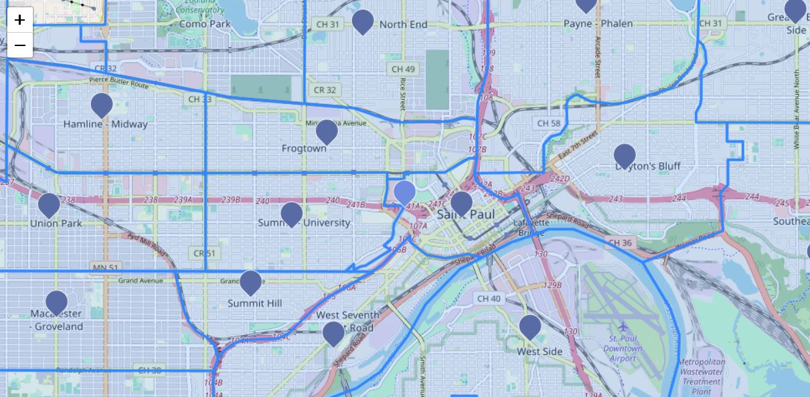

# St. Paul Crime RESTful-API

This RESTful-API was created to query St. Paul Crime data that was collected and released by the St. Paul Police Department. The main focus of this part of the assignment was to use Node.js along with SQL to retrieve the desired data being requested by the client. 

There are three paths that the RESTful-API can be queried by: 

- Codes: 
  1. Code (INTEGER) - crime incident type numeric code
  2. incident_type (TEXT) - crime incident type description
- Neighborhoods:
  1. neighborhood_number (INTEGER) - neighborhood id
  2. neightborhood_name (TEXT) - neighborhood name
- Incidents: 
  1. case_number (TEXT): unique id from crime case
  2. date_time (DATETIME): date and time when incident took place
  3. code (INTEGER): crime incident type numeric code
  4. incident (TEXT): crime incident description (more specific than incident_type)
  5. police_grid (INTEGER): police grid number where incident occurred
  6. neighborhood_number (INTEGER): neighborhood id where incident occurred
  7. block (TEXT): approximate address where incident occurred

- Neighborhoods can be queried by the following: id (INTEGER)
- Codes can be queried by the following: code (INTEGER)
- Incidents can be queried by the following: 
   - start_date=yyyy-mm-dd (DATE)
   - end_date=yyyy-mm-dd (DATE)
   - code (INTEGER)
   - grid (INTEGER)
   - neighborhood (INTEGER)
   - limit (INTEGER)

- Example CMD Operation: 
   ```
   curl -X GET "http://localhost:8000/incidents?grid=5&limit=5"
   ```


In addition to these paths, there was also functionality added where new incidents can be added and current incidents 
can be deleted. 

- Example CURL CMD Operation: 
   ```
   curl -X DELETE "http://localhost:8000/remove-incident" -H "Content-Type: application/json" -d "{\"case_number\": 5}"
   ```
   ```
   curl -X PUT "http://localhost:8000/new-incident" -H "Content-Type: application/json" -d "{\"case_number\": \"19245014\", \"date\": \"2019-10-30\",\"time\": \"23:43:19\",\"code\": 700,\"incident\": \"Auto Theft\",\"police_grid\": 95,\"neighborhood_number\": 4,\"block\": \"79X 6 ST E\"}"
   ```

# Plug and Play

To use this project you will need to do the following: 

1. Clone this project into your personal integrated development environment (IDE)
2. If you have not already install Node.js to run in your (IDE)
3. Navigate to the file directory that holds this project in your IDE
4. Install project dependencies by typing the following in the terminal: 

```npm install```

5. Run the project by typing the following in the terminal: 

``` Node server.js```

You should then see the following in the terminal: 

``` 
   Now listening on port 8000
   Now connected to stpaul_crime.sqlite3
```

You can query by CMD using curl or for get requests by the browser by going to localhost on port 8000. 

There is also the following online tool for querying: [Webtools](https://www.webtools.services/online-rest-api-client)

## VueJS User Interface

You can see the VueJS User Interface that was created alongside this RESTful-API server in this Repo: [Github Repository](link add later).